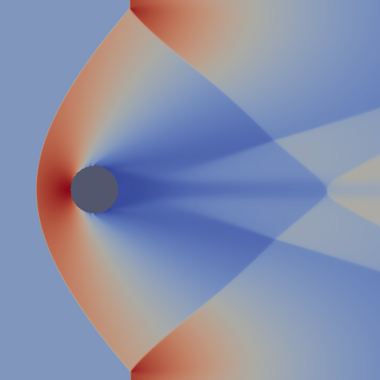
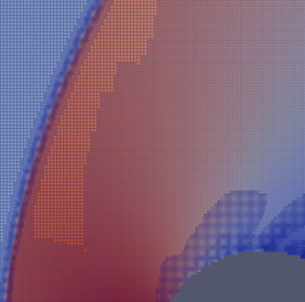

<!--
SPDX-License-Identifier: Apache-2.0
Copyright (c) 2024 Sebastien DUBOIS and the HPC@Maths Team, CMAP Laboratory, Ecole Polytechnique
-->
# Subsetix Kokkos

> **Sparse Finite Volume Discretization on Complex 2D Geometries with GPU Acceleration**

Subsetix is a modern C++20 library for solving hyperbolic PDEs on sparse 2D domains using a novel **Compressed Sparse Row (CSR) of intervals** data structure. Built on Kokkos for portable performance across CPUs and GPUs.

---

## Mach 2 Flow Demo

### Shock Capturing on Complex Geometry

Mach 2 flow over a cylinder obstacle, showing density field with adaptive mesh refinement around shock waves.



### Adaptive Mesh Refinement

Close-up showing the 4-level AMR grid structure. Refinement automatically follows the shock front.



**Run this example:**
```bash
./build-serial/examples/fvd_mach2_cylinder_example
```

---

## Features

- **Sparse-first design**: Memory-efficient representation of complex 2D geometries
- **GPU-native**: Zero-copy data structures via Kokkos — same code runs on CPU and GPU
- **Set algebra**: Compose geometries with boolean operations (union, intersection, difference)
- **AMR-ready**: Block-structured adaptive mesh refinement built into the core representation
- **High-level FVD API**: Solve hyperbolic PDEs in ~10 lines of code
- **Header-only**: Easy integration with no build-time dependencies beyond Kokkos

---

## Quick Start

### Prerequisites

| Requirement | Minimum | Recommended |
|-------------|---------|-------------|
| C++ compiler | C++20 compliant | GCC 12+ |
| CMake | 3.16 | 3.23+ (for presets) |
| Kokkos | 4.5.00 (auto-fetched) | — |
| CUDA (optional) | CUDA 12.x | — |

### Build

```bash
# Clone the repository
git clone https://github.com/sbstndb/subsetix_kokkos.git
cd subsetix_kokkos

# Configure (choose one preset)
cmake --preset serial          # CPU only
cmake --preset openmp          # CPU with OpenMP
cmake --preset cuda-gcc12      # NVIDIA GPU

# Build
cmake --build --preset serial

# Run tests
ctest --preset serial
```

### Available Presets

| Preset | Backend | Description |
|--------|---------|-------------|
| `serial` | Serial | Basic CPU execution |
| `openmp` | OpenMP | Multi-threaded CPU |
| `cuda-gcc12` | CUDA | NVIDIA GPU (requires GCC 12) |
| `serial-asan` | Serial + sanitizers | Debug mode with AddressSanitizer |
| `experimental-serial` | Serial (experimental only) | Experimental module, serial backend |
| `experimental-openmp` | OpenMP (experimental only) | Experimental module, OpenMP backend |
| `experimental-cuda-gcc12` | CUDA (experimental only) | Experimental module, CUDA backend |
| `experimental-asan` | Serial + sanitizers (experimental) | Experimental module with sanitizers |
| **Profiling presets** |||
| `experimental-perf-serial` | Serial + Linux perf | CPU performance analysis |
| `experimental-perf-openmp` | OpenMP + Linux perf | CPU performance analysis |
| `experimental-serial-profile` | Serial + Kokkos tools | Kernel-level profiling |
| `experimental-openmp-profile` | OpenMP + Kokkos tools | Kernel-level profiling |
| `experimental-cuda-gcc12-profile` | CUDA + Kokkos tools | GPU kernel profiling |
| `profiling-nsight-cuda-gcc12` | CUDA + Nsight | Detailed GPU analysis |
| `profiling-nsight-cuda-gcc12-release` | CUDA + Nsight (Release) | Production GPU analysis |

### Experimental Algorithms

An experimental module (`experimental/`) provides alternative set algebra implementations for algorithm research and comparison. This module is **completely isolated** from the stable codebase and uses a separate namespace (`experimental::subsetix::csr`).

**Key features:**
- Versioned algorithm framework (v1, v2, v3) for performance comparison
- Dedicated tests and benchmarks
- No stability guarantees - APIs may change

Enable with dedicated presets (recommended):
```bash
cmake --preset experimental-serial      # Serial backend
cmake --build --preset experimental-serial
ctest --preset experimental-serial

cmake --preset experimental-openmp      # OpenMP backend
cmake --build --preset experimental-openmp

cmake --preset experimental-cuda-gcc12  # CUDA backend
cmake --build --preset experimental-cuda-gcc12
```

Run benchmarks:
```bash
./build-experimental-serial/experimental/benchmarks/experimental_comparison_benchmark
```

### Profiling

The project supports three profiling approaches for performance analysis:

**Available Profiling Tools:**

| Tool | Best For | Backend | Preset |
|------|----------|---------|--------|
| **Linux perf** | CPU analysis (hot paths, cache, branches) | Serial, OpenMP | `experimental-perf-*` |
| **Nsight (ncu/nsys)** | GPU kernel profiling and timelines | CUDA | `profiling-nsight-*` |
| **Kokkos tools** | Kernel-level timing and memory | All | `experimental-*-profile` |

**Quick Start:**

```bash
# Linux perf (CPU profiling)
cmake --preset experimental-perf-serial
cmake --build --preset experimental-perf-serial
./scripts/perf_profile.sh ./build-experimental-perf-serial/experimental/benchmarks/experimental_comparison_benchmark

# Nsight (GPU profiling)
cmake --preset profiling-nsight-cuda-gcc12
cmake --build --preset profiling-nsight-cuda-gcc12
./scripts/profiling/run_ncu.sh experimental_comparison_benchmark

# Kokkos profiling tools
cmake --preset experimental-serial-profile
cmake --build --preset experimental-serial-profile
./scripts/profile_benchmark.sh experimental-serial-profile kernel-timer "SmallConfig"
```

**Documentation:** See **PROFILING.md** for comprehensive profiling guide.

---

## Usage Examples

### Hello World: Advection in 10 Lines

```cpp
#include <subsetix/fvd/solver/adaptive_solver.hpp>
#include <subsetix/fvd/system/advection2d.hpp>
#include <subsetix/fvd/solver/solver_aliases.hpp>

using namespace subsetix::fvd;

using MySolver = EulerSolver2ndHLLC<float>;

int main() {
    // Build geometry: box with cylinder obstacle
    auto fluid = Geometry2D<float>::build_box(400, 160, 0.005f, 0.005f)
                     .add_cylinder(0.5f, 0.4f, 0.1f, /* inside= */ true)
                     .build();

    // Configure solver
    MySolver::Config cfg = MySolver::Config::from_cfl(0.45f);
    cfg.gamma = 1.4f;
    cfg.refine_fraction = 0.1f;

    // Create and initialize
    MySolver solver(fluid, {0, 400, 0, 160}, cfg);
    solver.initialize(Euler2D<float>::Primitive{1.0f, 2.0f, 0.0f, 1.0f/1.4f});

    // Time march
    while (solver.time() < 1.0f) {
        solver.step();
        solver.write_vtk("output_" + std::to_string(solver.step()) + ".vtk");
    }
}
```

### Low-Level CSR Operations

```cpp
#include <subsetix/geometry/csr_set_ops.hpp>
#include <subsetix/geometry/csr_generators.hpp>

using namespace subsetix::csr;

// Create geometries
auto box = make_box_device(Box2D{0, 100, 0, 100});
auto disk = make_disk_device(Disk2D{50, 50, 20});

// Compute difference (box with hole)
CsrSetAlgebraContext ctx;
auto result = allocate_interval_set_device(100, 10);
set_difference_device(box, disk, result, ctx);
compute_cell_offsets_device(result);

// Export to VTK
vtk_export_device(result, "geometry.vtk");
```

### More Examples

See the `examples/` directory:
- `fvd_mach2_cylinder_example.cpp` - Mach 2 flow over cylinder
- `fvd_simulation_examples.cpp` - 16+ usage patterns (AMR, BCs, checkpoint)

---

## Documentation

### Core Concepts

#### CSR of Intervals

Subsetix represents 2D domains as rows of X-intervals:

```cpp
template <class MemorySpace>
struct IntervalSet2D {
  Kokkos::View<RowKey2D*, MemorySpace>   row_keys;     // Y coordinates
  Kokkos::View<std::size_t*, MemorySpace> row_ptr;      // CSR pointers
  Kokkos::View<Interval*, MemorySpace>    intervals;    // [begin, end) X intervals
  std::size_t total_cells;                              // Sum of interval lengths
};
```

**Why this matters:**
- **O(n) memory** where n = active cells (not domain size)
- **GPU-friendly**: All data in `Kokkos::View`
- **AMR-native**: Refinement is simple interval arithmetic (×2 or ÷2)

#### Module Organization

```
include/subsetix/
├── geometry/        # CSR interval sets, set algebra
├── field/           # Fields on sparse geometries
├── csr_ops/         # Parallel kernels (stencil, transform, AMR)
├── multilevel/      # AMR hierarchies
├── io/              # VTK export
└── fvd/             # Finite Volume Discretization layer
    ├── geometry/    # Fluent geometry builder
    ├── system/      # PDE systems (Euler2D, Advection2D)
    ├── solver/      # Adaptive solver
    └── time/        # Runge-Kutta integrators
```

### API Reference

#### Geometry Builder

```cpp
auto geom = Geometry2D<float>::build_box(nx, ny, dx, dy)
    .add_cylinder(cx, cy, radius, inside)
    .add_rectangle(x0, x1, y0, y1, inside)
    .add_bitmap("obstacle.pbm", inside)
    .build();
```

#### Solver Configuration

```cpp
MySolver::Config cfg;
cfg.cfl = 0.45f;              // CFL number
cfg.gamma = 1.4f;             // Heat capacity ratio
cfg.refine_fraction = 0.1f;   // AMR: fraction of cells to refine
cfg.coarsen_fraction = 0.05f; // AMR: fraction to coarsen
cfg.min_level = 0;            // AMR: minimum refinement level
cfg.max_level = 2;            // AMR: maximum refinement level
```

#### Boundary Conditions

```cpp
// Inflow/Outflow
auto bc = BoundaryConfigBuilder<Euler2D<float>>::inflow_outflow(inflow, gamma);
solver.set_boundary_conditions(bc);

// Time-dependent
solver.set_time_dependent_bc("left", [](double t) {
    return Primitive{1.0f, 0.5f * sin(t), 0.0f, 1.0f};
});
```

#### Source Terms

```cpp
// Gravity
solver.add_gravity(-9.81f);

// Custom source
solver.add_source([](const auto& U, const auto& q, Real x, Real y, Real t) {
    return Conserved{0, 0, 0, heating_rate(x, y, t)};
});
```

---

## Testing

```bash
# Run all tests
ctest --preset serial

# Run specific test suite
./build-serial/tests/subsetix_test_core
./build-serial/tests/subsetix_test_ops
./build-serial/tests/subsetix_test_advanced
./build-serial/tests/subsetix_test_amr
./build-serial/tests/subsetix_test_fvd_api
./build-serial/tests/subsetix_test_fvd_execution
./build-serial/tests/subsetix_test_fvd_integrators
```

---

## Performance Tips

### GPU Optimization

```cpp
// Enable CUDA graph for 10-100x speedup
// (reduces CPU-GPU synchronization)
MySolver solver(...);
solver.enable_cuda_graph(true);
```

### Memory Management

```cpp
// Reuse workspace for multiple operations
CsrSetAlgebraContext ctx;  // Allocate once
set_union_device(A, B, result, ctx);
set_intersection_device(C, D, result2, ctx);  // Reuses memory
```

---

## Contributing

See `AGENTS.md` for coding guidelines and `CLAUDE.md` for architecture details.

---

## License

Apache License 2.0

See [LICENSE](LICENSE) file for details.

---

## Links

- **Architecture Details**: See `CLAUDE.md`
- **Development Guidelines**: See `AGENTS.md`
- **3D Design Notes**: See `3D.md`
- **FVD Specification**: See `docs/fvd_layer_proposal_v3.1.md`
